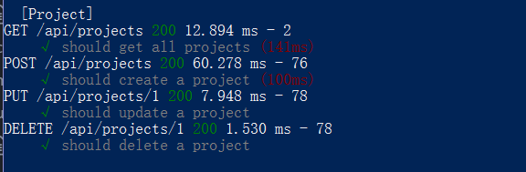

## Full Stack - web application: Software Project Quality Indicator

## Project Duration: August 2017 to October 2017
## Introduction
The Quality Indicator, which measures the firmware quality status during and at the end of the project life cycle, are composed of “DO” data and “END IT” data. Currently, the Project Quality Indicator is documented in Excel. However, the excel version lacks flexibility in maintenance and expandability. In addition, the quality indicator should have the capability to be integrated into the quality state model for future expansion. Therefore, a web-based application that record and present the project quality data is required.

The application is deployed using Heroku at `https://express-quiality-indicator.herokuapp.com/#/`
. The mongodb is not deployed yet due to account verification.

__Functional requirement__
1.	CRUD API of Project Information
2.  Calculate project quality indicator
4.	Record the current status and history of the quality indicator
5.	Upload and download interface for data in Excel format

## Design
The website is about Overview/Add/List view in a single page app.

## Methodology
Install MongoDB and open the mongod.exe in command line`mongod.exe`

Build the REST API system using express and mongo db.
Download and install nodejs(with npm inside).
We're going to use mocha and chai along with supertest to run integration test against our api. Install testing environment:
```bash
npm i -g nodemon
npm i -g mocha
npm install
npm test
npm start
```
<p align="center">
  
</p>

## Plan and Milestone
- 8/11 – 8/18: Build the functional property of the website server  
- Milestone: Set up backend environment, create RESTful api
- Milestone: Setup testing code and create mongo database for project
	- Completed integration testing code
	- Built model for category/user/project in MongoDB
	- reorganized project structure
- 8/28 - 9/8: Querying mongo database and Authentication
- Milestone: Query and User authentication function from the server.
  - Completed CRUD function for project API and frontend
  - Design UI style to meet business demand
  - [Docker](https://docs.docker.com/engine/reference/builder/#usage)

## To do
- build and query MongoDB database
- Authentication on the mongo model (look into password.js in the future)
- unit test for testibility
- complicated RESTful api: parse API.
- PubNub real-time communication
- JSCS: [convert jscs into eslint](https://eslint.org/blog/2016/04/welcoming-jscs-to-eslint)
- [Node, react web resource](https://www.scotch.io/)
- Build depolyable system with Mern and Electrode
- [Polar Spider chart](https://code.hcharts.cn/demos/hhhhi6)

## Resource
- [My note on middleware/nodejs](./study/note.md)
- [Lynda Node js tutorial](https://www.lynda.com/Node-js-tutorials/)
- [My MongoDB notes](./study/mongodb.md)
- [MERN stack](https://resources.mongodb.com/getting-started-with-mongodb/the-modern-application-stack-part-1-introducing-the-mean-stack)
- [MongoDB online course](https://university.mongodb.com/)
